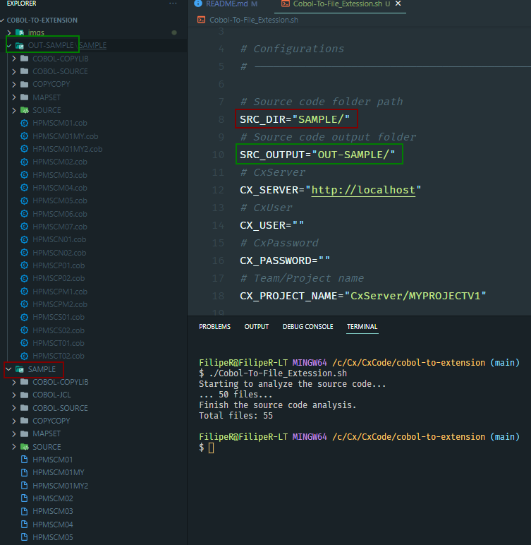

# Cobol To File Extension

## Overview

The main purpose of this script is to convert cobol files without extension to files with extension "cob" or "cpy".


### __Rules__
We follow the following rules to identify files:

- A valid cobol file must contain either __"IDENTIFICATION DIVISION."__ or __"ID DIVISION."__ in its content.
- A cobol file can use the instruction "COPY XXXXXX." where "XXXXXX" will be a copybook.

### __Sample__
The sample used is based on the repo: https://github.com/haynieresearch/cics-process-management

### __Configurations__



- **SRC_DIR**: Source code folder path
- **SRC_OUTPUT**: Source code output folder
- **CX_SERVER**: Server URL
- **CX_USER**: CX user
- **CX_PASSWORD**: CX Password
- **CX_PROJECT_NAME**: Team/Project name

### __Run script__

```sh
./Cobol-To-File_Extession.sh
```

### __Run script with checkmarx cli__

For this we will need Checkmarx CLI.

```sh
./CLI_Cobol-To-File_Extession.sh
```


